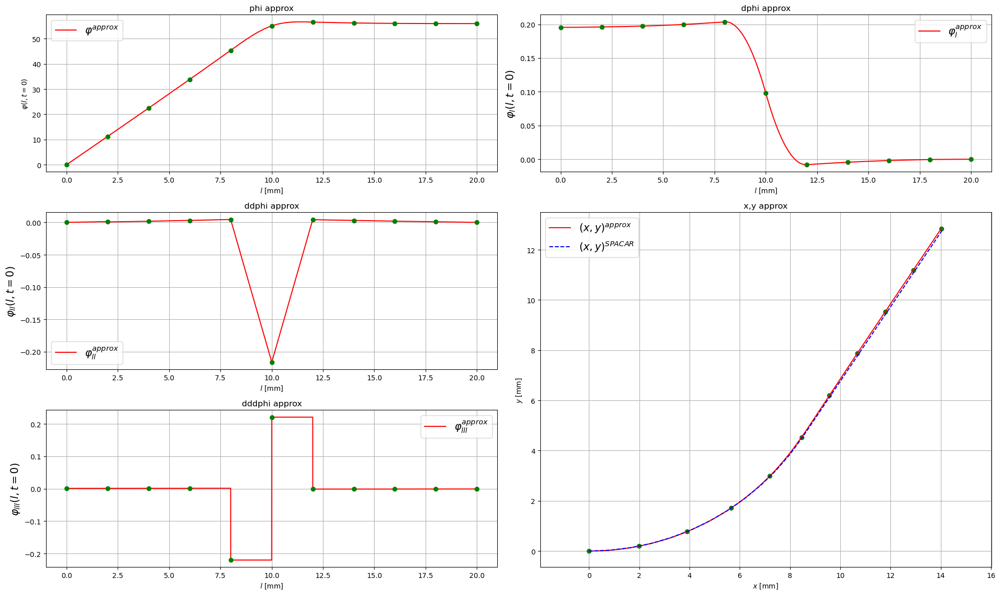
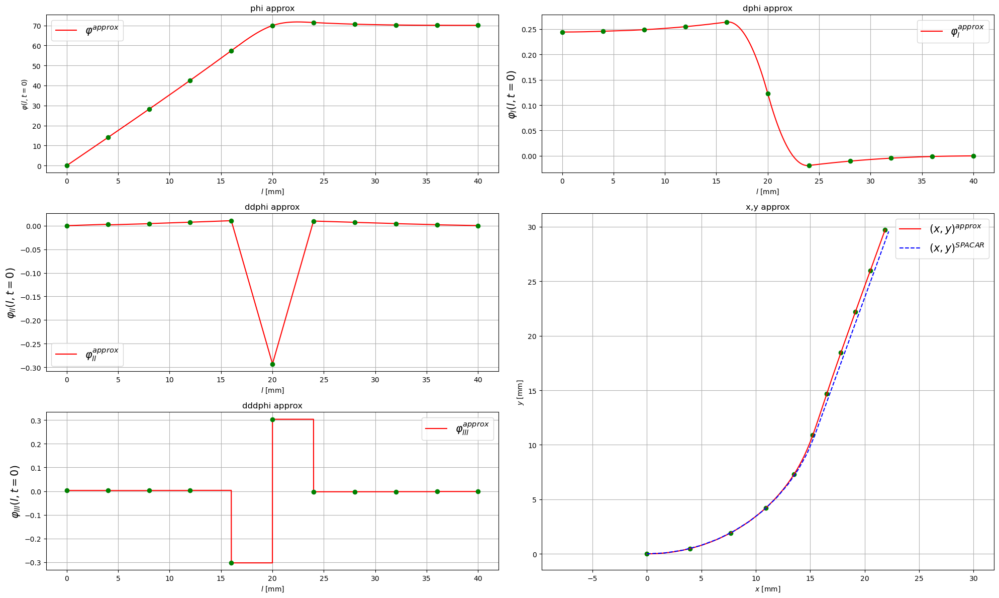

# dynastatflex
Python library for modeling dynamic (now only static) of flexible mechanisms. Useful for robotics application.

There is pipline for future development and equations derivation: [MODELING_WITH_DAMPING.md](logsec/MODELING_WITH_DAMPING.md)

## Dependencies
If you want use MATLAB SPACAR package to compare the results you need MATLAB. 
- - - -
Was tested with 2023a version.

## Installation
First need to setup conda environment:
```
conda env create --file dynastatflex.yml -n dynastatflex
```
If you using VSC, then reload it. Choose dynastatflex environment.
- - - - 
If you want to update conda env with .yml file type in Command Prompt:
```
conda env update --file dynastatflex.yml --prune
```
## Examples

- - - -


## Referencies:
[1] Huber G, Wollherr D and Buss M (2021) A Concise and Geometrically Exact Planar Beam Model for Arbitrarily Large Elastic Deformation Dynamics. Front. Robot. AI 7:609478. doi: 10.3389/frobt.2020.609478. link=[https://www.frontiersin.org/articles/10.3389/frobt.2020.609478/full](https://www.frontiersin.org/articles/10.3389/frobt.2020.609478/full)
- - - -
```
1 Зачем возмущаются народы, и язычники замышляют пустое?
2 Восстают земные цари, и правители собираются вместе против Господа
 и против Его Помазанника.
3 «Цепи Их разорвем, — говорят. — Оковы Их сбросим!»

4 Восседающий на небесах смеется, Владыка насмехается над ними.
5 Тогда скажет им во гневе Своем и яростью Своею приведет их в смятение:
6 «Я поставил Царя Своего над Сионом, Моей святой горой».

7 Возвещу волю Господа. Он сказал Мне: «Ты Сын Мой, сегодня Я родил Тебя.
8 Проси у Меня, и отдам народы Тебе в наследие, края земли — Тебе во владение.
9 Сокрушишь их железным скипетром, как сосуд горшечника расколешь».

10 Итак, образумьтесь, цари, научитесь, земные судьи!
11 Служите Господу со страхом и радуйтесь с трепетом.
12 Целуйте Сына, чтобы Он не разгневался, и вы не погибли в пути, потому
что гнев Его быстро вспыхивает. Блаженны все, кто у Него ищет прибежища.

Псалом 2 — Псалтирь — Библия — Новый русский перевод
```


